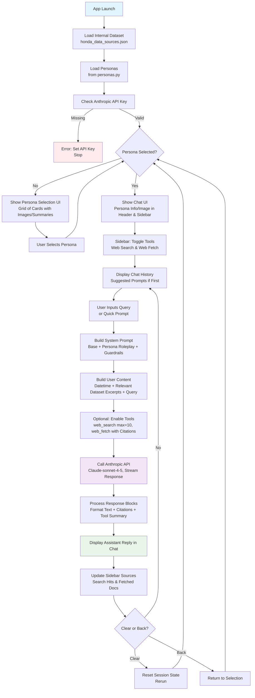

# Honda Personas App Flowchart

This Mermaid diagram illustrates the main user flow and processing logic of the Streamlit app for simulating Honda market research interviews with Indian user personas.

## Key Notes

- **Initialization**: Caches dataset; stops if no API key.
- **Persona Selection**: Displays 9 personas (e.g., Priya Sharma, Rajesh Kumar) in a 3-column grid.
- **Chat Loop**: AI role-plays in first-person, integrates internal data (top 4 relevant rows via keyword matching), and uses tools for live info.
- **Tools**: Optional; sidebar shows usage summaries (e.g., search queries, fetched URLs).
- **Error Handling**: API errors (rate limits, status) shown in chat; fallback for empty responses.

To view: Open in VS Code (with Mermaid extension), GitHub, or [Mermaid Live](https://mermaid.live).
