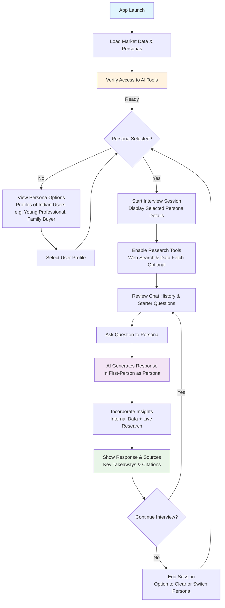

# Honda Personas App: Business Overview

This Streamlit app enables quick simulations of user interviews with diverse Indian personas (e.g., young professionals, family buyers) to uncover market insights for Honda's research. Select a persona, ask targeted questions, and get AI-generated responses in their voice—blending internal Honda data with live web research and citations. Ideal for stakeholders to explore customer needs, pain points, and trends without real interviews.

## User Flow Diagram

    D -->|No| E[View Persona Options Profiles of Indian Users e.g. Young Professional, Family Buyer]
    E --> F[Select User Profile]
    F --> D

    D -->|Yes| G[Start Interview Session Display Selected Persona Details]
    G --> H[Enable Research Tools Web Search & Data Fetch Optional]
    H --> I[Starter Questions]
    I --> J[Ask Question to Persona]
    J --> K[AI Generates Response In First-Person as Persona]
    K --> L[Incorporate Insights Internal Data + Live Research]
    L --> M[Show Response & Sources Key Takeaways & Citations]
    M --> N{Continue Interview?}
    N -->|Yes| I
    N -->|No| O[End Session Option to Clear or Switch Persona]
    O --> D

    style A fill:#e1f5fe
    style C fill:#fff3e0
    style K fill:#f3e5f5
    style M fill:#e8f5e8
